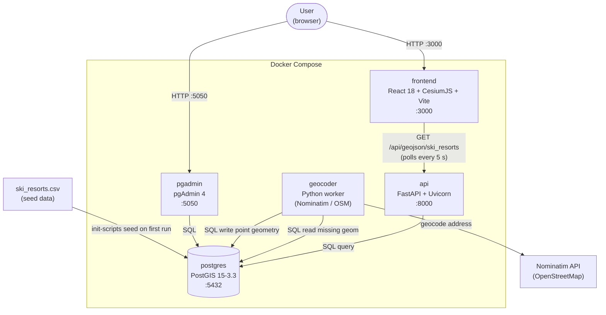

# SkiSpatialDB

Interactive 3D globe for exploring Canadian ski resorts.
Built with **CesiumJS**, **FastAPI**, **PostGIS**, and **Docker Compose**.

## Architecture



| Service      | Tech                        | Port  |
|--------------|-----------------------------|-------|
| **frontend** | React 18 + CesiumJS + Vite  | 3000  |
| **api**      | FastAPI + Uvicorn            | 8000  |
| **postgres** | PostGIS 15-3.3              | 5432  |
| **pgadmin**  | pgAdmin 4                   | 5050  |
| **geocoder** | Python worker (Nominatim)   | —     |

## Quick start

```bash
docker compose up --build -d
```

Open <http://localhost:3000> to see the 3D globe.

### What happens on first run

1. **PostGIS** creates the `ski_resorts` table and loads ~47 resorts from a CSV seed file.
2. The **geocoder** worker picks up any rows missing a `geom_wgs84` column, geocodes them via OpenStreetMap/Nominatim, and writes the point geometry back.
3. The **API** serves GeoJSON at `/api/geojson/ski_resorts`.
4. The **frontend** polls the API every 5 s and renders each resort as a labelled point on a Cesium Ion World Terrain globe.

## API

| Method | Path                        | Description                                 |
|--------|-----------------------------|---------------------------------------------|
| GET    | `/api/geojson/ski_resorts`   | All ski resorts with geometry as GeoJSON     |
| GET    | `/api/geojson/{table}`       | Generic GeoJSON for any `geom_wgs84` table  |
| GET    | `/api/tables`                | List tables that have a `geom_wgs84` column |

## Data

`init-scripts/ski_resorts.csv` contains the seed data (name, province, nearest city, vertical drop, run count, lift count, and WGS 84 coordinates).

## Development

The Vite dev server proxies `/api` to the FastAPI container, so you can run the frontend locally with hot-reload:

```bash
cd frontend && npm install && npm run dev
```

## License

MIT
